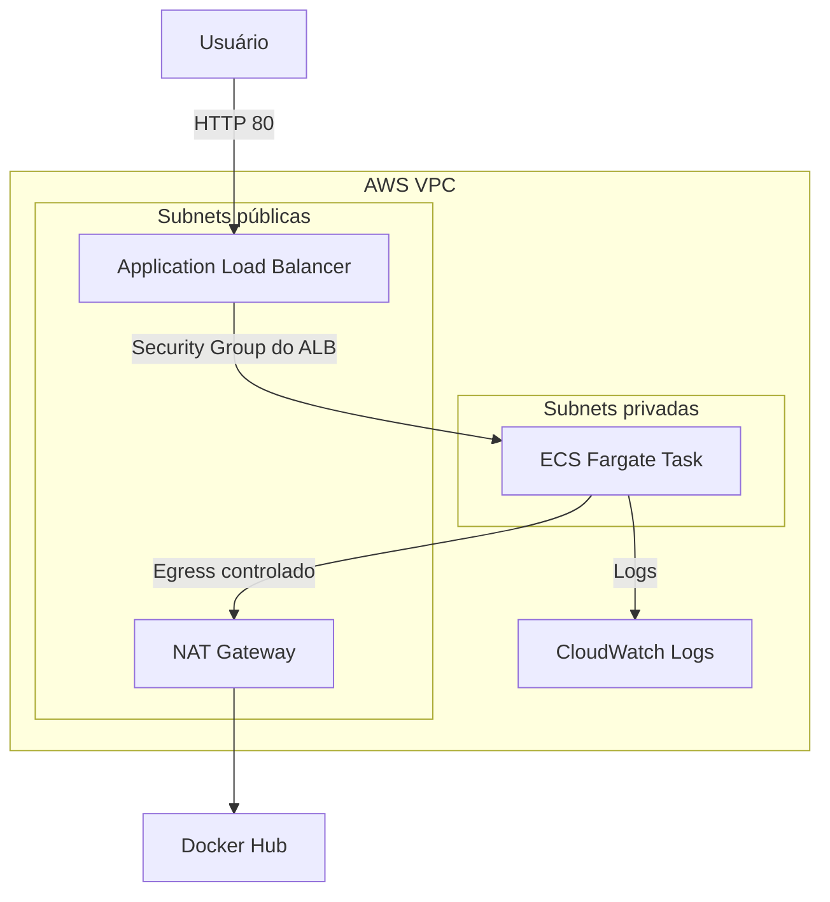

# Desafio Técnico DevOps — ECS Fargate, ALB, Terraform e Terragrunt

Solução desenvolvida para o desafio técnico de DevOps da Sensedia.

O projeto empacota um frontend estático em uma imagem NGINX, publica a imagem no Docker Hub por meio do GitHub Actions e define uma infraestrutura AWS reutilizável com Terraform e Terragrunt.

> Conforme solicitado no enunciado, este repositório entrega somente os fontes. A infraestrutura não foi mantida em execução e pode ser validada pela equipe da Sensedia em uma conta AWS de testes.

## Visão geral da solução

A aplicação é executada no Amazon ECS com Fargate, dentro de subnets privadas e sem endereço IP público. O acesso externo ocorre exclusivamente por um Application Load Balancer localizado em subnets públicas.

A solução contém:

- frontend estático HTML, CSS e JavaScript;
- imagem Docker baseada em NGINX;
- injeção de versão durante a inicialização do container;
- endpoint de saúde `/health`;
- pipeline GitHub Actions para build e publicação da imagem;
- VPC com subnets públicas e privadas;
- Application Load Balancer público;
- ECS Fargate privado;
- Security Groups com acesso restrito;
- logs no Amazon CloudWatch;
- IAM com separação entre Task Role e Task Execution Role;
- estado remoto Terraform no S3;
- state locking no DynamoDB;
- três ambientes Terragrunt: `dev`, `qa` e `prod`.

## Arquitetura



### Fluxo de acesso

1. O usuário acessa o DNS público do ALB pela porta `80`.
2. O ALB encaminha a requisição para o Target Group.
3. O Target Group acessa a task ECS na subnet privada.
4. O Security Group da task aceita tráfego somente do Security Group do ALB.
5. A task não possui IP público.
6. A saída para download da imagem pública ocorre por meio do NAT Gateway.
7. Os logs do container são enviados ao CloudWatch Logs.

## Estrutura do repositório

```text
.
├── .github/
│   └── workflows/
│       └── build-and-push.yml
├── docker/
│   ├── entrypoint/
│   │   └── 99-inject-app-version.sh
│   └── nginx/
│       └── default.conf
├── live/
│   ├── root.hcl
│   ├── dev/
│   │   ├── .terraform.lock.hcl
│   │   └── terragrunt.hcl
│   ├── qa/
│   │   ├── .terraform.lock.hcl
│   │   └── terragrunt.hcl
│   └── prod/
│       ├── .terraform.lock.hcl
│       └── terragrunt.hcl
├── modules/
│   └── ecs_nginx_app/
│       ├── main.tf
│       ├── outputs.tf
│       ├── variables.tf
│       ├── versions.tf
│       └── .terraform.lock.hcl
├── src/
│   ├── css/
│   ├── js/
│   └── index.html
├── .dockerignore
├── .gitattributes
├── .gitignore
├── Dockerfile
└── README.md
```

## Container NGINX

O `Dockerfile`:

- utiliza NGINX como servidor web;
- copia o frontend de `src/`;
- configura logs de acesso em `stdout`;
- configura logs de erro em `stderr`;
- expõe a porta `80`;
- possui health check nativo;
- executa um script de inicialização para injetar a versão da aplicação.

### Versão em tempo de execução

O arquivo `src/index.html` contém o placeholder:

```text
__APP_VERSION__
```

No início do container, o script `99-inject-app-version.sh` substitui esse placeholder pelo valor da variável de ambiente:

```text
APP_VERSION
```

A substituição acontece durante a inicialização do container, e não durante o build da imagem.

Exemplo:

```bash
docker run \
  --detach \
  --name sensedia-devops \
  --publish 8080:80 \
  --env APP_VERSION=local-1.0.0 \
  lucasbarrosodemattos/desafio-tecnico-devops:sha-8d8f435
```

A página mostrará:

```text
Versão: local-1.0.0
```

## Build e teste local

### Pré-requisitos

- Git;
- Docker;
- acesso à internet.

### Construir a imagem

```bash
docker build \
  --tag lucasbarrosodemattos/desafio-tecnico-devops:local \
  .
```

### Executar o container

```bash
docker run \
  --detach \
  --name sensedia-devops-local \
  --publish 8080:80 \
  --env APP_VERSION=local-1.0.0 \
  lucasbarrosodemattos/desafio-tecnico-devops:local
```

### Acessar a aplicação

Abra no navegador:

```text
http://localhost:8080
```

### Validar o endpoint de saúde

```bash
curl http://localhost:8080/health
```

Resposta esperada:

```json
{"status":"healthy","service":"nginx"}
```

### Verificar o estado do container

```bash
docker ps --filter "name=sensedia-devops-local"
```

O estado deve apresentar:

```text
healthy
```

### Consultar os logs

```bash
docker logs sensedia-devops-local
```

### Remover o container

```bash
docker rm --force sensedia-devops-local
```

## Docker Hub

Repositório público da imagem:

```text
lucasbarrosodemattos/desafio-tecnico-devops
```

Exemplo de download:

```bash
docker pull lucasbarrosodemattos/desafio-tecnico-devops:sha-8d8f435
```

As imagens são publicadas com tags baseadas no SHA curto do commit:

```text
sha-<commit>
```

A tag `latest` é publicada somente quando o workflow é executado na branch `main`.

## GitHub Actions

O workflow está localizado em:

```text
.github/workflows/build-and-push.yml
```

Ele executa:

1. checkout do repositório;
2. configuração do Docker Buildx;
3. autenticação no Docker Hub;
4. geração das tags e metadados;
5. build da imagem para `linux/amd64`;
6. publicação da imagem no Docker Hub.

O workflow é acionado em pushes para:

- `main`;
- branches `feat/**`;
- execução manual com `workflow_dispatch`.

### Secrets necessários

Os seguintes secrets devem ser configurados em:

```text
Settings > Secrets and variables > Actions
```

| Secret | Descrição |
| --- | --- |
| `DOCKERHUB_USERNAME` | Usuário do Docker Hub |
| `DOCKERHUB_TOKEN` | Personal Access Token do Docker Hub com permissão de escrita |

As credenciais não são armazenadas no código.

## Infraestrutura Terraform

O módulo reutilizável está localizado em:

```text
modules/ecs_nginx_app
```

Ele provisiona:

- VPC;
- duas subnets públicas;
- duas subnets privadas;
- Internet Gateway;
- tabelas e associações de rotas;
- NAT Gateway para saída das subnets privadas;
- Security Group do ALB;
- Security Group das tasks;
- Application Load Balancer;
- Target Group;
- listener HTTP;
- ECS Cluster;
- ECS Task Definition;
- ECS Service Fargate;
- CloudWatch Log Group;
- Task Execution Role;
- Task Role;
- políticas IAM granulares.

## Ambientes Terragrunt

Os ambientes ficam em:

```text
live/dev
live/qa
live/prod
```

A configuração compartilhada está em:

```text
live/root.hcl
```

Cada ambiente utiliza seu próprio caminho de estado no S3.

| Ambiente | CIDR da VPC | Tasks | NAT Gateways | Retenção de logs |
| --- | --- | ---: | ---: | ---: |
| `dev` | `10.10.0.0/16` | 1 | 1 | 7 dias |
| `qa` | `10.20.0.0/16` | 1 | 1 | 14 dias |
| `prod` | `10.30.0.0/16` | 2 | 2 | 30 dias |

O ambiente `prod` utiliza maior capacidade e dois NAT Gateways para melhorar a disponibilidade.

## Estado remoto

O Terragrunt configura automaticamente:

- backend remoto no S3;
- criptografia AES-256;
- versionamento do bucket;
- state locking no DynamoDB;
- criptografia da tabela de locks;
- um caminho de state diferente para cada ambiente.

Variáveis opcionais:

| Variável | Finalidade |
| --- | --- |
| `AWS_REGION` | Região AWS. Padrão: `us-east-1` |
| `TF_STATE_BUCKET` | Nome globalmente único do bucket de state |
| `TF_STATE_LOCK_TABLE` | Nome da tabela DynamoDB de locks |

### Exemplo no PowerShell

```powershell
$env:AWS_REGION = "us-east-1"
$env:TF_STATE_BUCKET = "<nome-globalmente-unico-do-bucket>"
$env:TF_STATE_LOCK_TABLE = "<nome-da-tabela-de-lock>"
```

### Exemplo em Linux ou macOS

```bash
export AWS_REGION="us-east-1"
export TF_STATE_BUCKET="<nome-globalmente-unico-do-bucket>"
export TF_STATE_LOCK_TABLE="<nome-da-tabela-de-lock>"
```

## Segurança de rede

### Security Group do ALB

Permite entrada:

```text
TCP/80 de 0.0.0.0/0
```

### Security Group da task ECS

Permite entrada:

```text
TCP/80 somente a partir do Security Group do ALB
```

Não existe regra pública com `0.0.0.0/0` no Security Group da task.

### Isolamento das tasks

O ECS Service utiliza:

```hcl
assign_public_ip = false
```

As tasks são executadas exclusivamente nas subnets privadas.

## IAM e princípio do menor privilégio

A solução separa explicitamente as duas funções utilizadas pelo ECS.

### ECS Task Execution Role

Utilizada pelo ECS/Fargate para atividades necessárias à inicialização da task.

Como a imagem está em um repositório público do Docker Hub, não são necessárias permissões AWS para pull no ECR.

A política de logs permite somente:

```text
logs:CreateLogStream
logs:PutLogEvents
```

O campo `Resource` aponta para o ARN do grupo de logs criado para a aplicação:

```hcl
"${aws_cloudwatch_log_group.application.arn}:*"
```

Não é utilizado `Resource: "*"` para gravação de logs.

Também não são utilizadas políticas genéricas como:

- `AdministratorAccess`;
- `PowerUserAccess`.

### ECS Task Role

A Task Role é associada ao container, mas não possui políticas ativas.

Isso ocorre porque a aplicação NGINX não chama nenhuma API da AWS.

Essa separação impede que o código da aplicação herde permissões utilizadas pelo agente do ECS.

## Health checks

Existem dois níveis de verificação.

### Container

A imagem e a Task Definition verificam:

```text
GET /health
```

O endpoint deve retornar HTTP `200`.

### Application Load Balancer

O Target Group verifica:

```text
GET /
```

O frontend deve retornar HTTP `200`.

O ECS somente considera saudável o tráfego encaminhado para targets aprovados pelo ALB.

## CloudWatch Logs

O container utiliza o driver:

```text
awslogs
```

Os logs do NGINX são enviados para um grupo dedicado do CloudWatch.

Como o NGINX grava:

- access log em `/dev/stdout`;
- error log em `/dev/stderr`;

os dois fluxos ficam disponíveis no CloudWatch Logs.

## Validação local dos fontes

As validações abaixo não criam recursos na AWS.

### Formatação Terraform

```bash
terraform fmt -check -recursive
```

### Inicialização e validação do módulo

```bash
terraform -chdir="modules/ecs_nginx_app" init -backend=false
terraform -chdir="modules/ecs_nginx_app" validate
```

Resultado esperado:

```text
Success! The configuration is valid.
```

### Formatação Terragrunt

```bash
terragrunt hcl fmt --check --working-dir="live"
```

### Validação dos inputs Terragrunt

```bash
terragrunt hcl validate --working-dir="live" --inputs --strict
```

### Inicialização segura dos ambientes

```bash
terragrunt run --working-dir="live/dev" -- init -backend=false -input=false
terragrunt run --working-dir="live/qa" -- init -backend=false -input=false
terragrunt run --working-dir="live/prod" -- init -backend=false -input=false
```

### Validação dos ambientes

```bash
terragrunt run --working-dir="live/dev" --no-auto-init -- validate
terragrunt run --working-dir="live/qa" --no-auto-init -- validate
terragrunt run --working-dir="live/prod" --no-auto-init -- validate
```

Os três ambientes foram formatados, inicializados com o backend desabilitado e validados localmente com sucesso.

## Execução em uma conta AWS

> A execução abaixo pode gerar custos. Revise o plano antes do `apply` e execute o `destroy` após o teste.

### 1. Configurar as credenciais

```bash
aws configure
```

Validar a identidade:

```bash
aws sts get-caller-identity
```

### 2. Definir o backend remoto

Configure nomes únicos:

```bash
export AWS_REGION="us-east-1"
export TF_STATE_BUCKET="<nome-globalmente-unico-do-bucket>"
export TF_STATE_LOCK_TABLE="<nome-da-tabela-de-lock>"
```

No PowerShell:

```powershell
$env:AWS_REGION = "us-east-1"
$env:TF_STATE_BUCKET = "<nome-globalmente-unico-do-bucket>"
$env:TF_STATE_LOCK_TABLE = "<nome-da-tabela-de-lock>"
```

### 3. Selecionar o ambiente

Exemplo com `dev`:

```bash
cd live/dev
```

### 4. Inicializar

```bash
terragrunt run -- init
```

### 5. Gerar e revisar o plano

```bash
terragrunt run -- plan -out=dev.tfplan
```

### 6. Aplicar

```bash
terragrunt run -- apply dev.tfplan
```

### 7. Consultar os outputs

```bash
terragrunt run -- output
```

## Validações solicitadas

### 1. Acesso público somente pelo ALB

Obtenha o DNS do ALB nos outputs:

```bash
terragrunt run -- output
```

Teste:

```bash
curl http://<DNS_DO_ALB>
```

A aplicação deve responder com HTTP `200`.

As tasks permanecem em subnets privadas, sem IP público e com entrada permitida apenas pelo Security Group do ALB.

### 2. Estado no S3 e lock no DynamoDB

Verificar o state do ambiente `dev`:

```bash
aws s3 ls "s3://$TF_STATE_BUCKET/dev/terraform.tfstate"
```

Verificar a tabela:

```bash
aws dynamodb describe-table \
  --table-name "$TF_STATE_LOCK_TABLE"
```

Durante uma operação Terraform, o DynamoDB impede alterações concorrentes no mesmo state.

### 3. IAM com escopo específico

A política está definida em:

```text
modules/ecs_nginx_app/main.tf
```

As ações de escrita no CloudWatch estão limitadas ao ARN do grupo de logs da aplicação.

A Task Role permanece sem políticas porque o NGINX não utiliza APIs da AWS.

### 4. Logs no CloudWatch

Consulte o nome do grupo nos outputs:

```bash
terragrunt run -- output
```

Depois execute:

```bash
aws logs tail "<NOME_DO_LOG_GROUP>" --follow
```

Ao acessar o DNS do ALB, novas requisições devem aparecer nos logs.

## Destruição dos recursos

Após os testes:

```bash
cd live/dev
terragrunt run -- destroy
```

Confirme digitando:

```text
yes
```

O bucket de state e a tabela de lock são recursos administrativos do backend. Antes de removê-los manualmente, confirme que nenhum ambiente ainda depende deles.

## Custos

Os componentes com maior possibilidade de cobrança são:

- NAT Gateway por hora e por volume processado;
- Application Load Balancer por hora e por capacidade utilizada;
- ECS Fargate por CPU e memória;
- endereços IPv4 públicos;
- CloudWatch Logs;
- armazenamento S3;
- requisições DynamoDB.

Para reduzir custos durante testes:

- utilizar somente o ambiente `dev`;
- manter apenas uma task;
- destruir os recursos imediatamente após a validação;
- conferir o AWS Cost Explorer e o painel de faturamento;
- evitar manter NAT Gateway e ALB ativos sem necessidade.

## Decisões técnicas

### Imagem pública no Docker Hub

Foi utilizada uma imagem pública para permitir que a equipe de avaliação execute a solução sem depender de credenciais privadas do registry.

### Tags imutáveis

O GitHub Actions publica uma tag baseada no SHA do commit. Isso permite identificar exatamente qual versão da imagem está sendo executada.

### Ambientes separados

Cada ambiente possui:

- CIDR próprio;
- state próprio;
- parâmetros de capacidade próprios;
- retenção de logs própria.

### Configuração raiz compartilhada

O arquivo `live/root.hcl` centraliza:

- provider AWS;
- região;
- backend S3;
- DynamoDB locking;
- tags comuns.

### NAT controlado

As tasks não recebem IP público. O NAT Gateway permite somente a saída necessária para baixar a imagem pública e acessar serviços externos.

## Limitações e melhorias futuras

Possíveis evoluções:

- adicionar HTTPS com ACM;
- configurar redirecionamento HTTP para HTTPS;
- utilizar AWS WAF;
- armazenar a imagem no Amazon ECR;
- adicionar VPC endpoints para reduzir dependência do NAT Gateway;
- habilitar autoscaling do ECS Service;
- adicionar alarmes do CloudWatch;
- adicionar análise automática de vulnerabilidades no pipeline;
- utilizar OpenID Connect para integrações futuras com a AWS;
- substituir o locking DynamoDB pelo mecanismo nativo mais recente do backend S3 quando aplicável ao ambiente.

## Validação real na AWS

A solução foi provisionada e validada no ambiente `dev`, na região `us-east-1`, em 21/08/2026. Após os testes, todos os recursos foram removidos para evitar custos.

### Resultados da validação

- `terraform plan`: **34 recursos a criar, 0 a alterar e 0 a destruir**;
- `terraform apply`: **34 recursos criados com sucesso**;
- ECS Service estabilizado com sucesso;
- Task do ECS executada em subnet privada;
- atribuição de IP público desabilitada: `assignPublicIp = DISABLED`;
- página principal acessada pelo ALB com HTTP `200`;
- endpoint `/health` acessado pelo ALB com HTTP `200`;
- resposta do health check: `{"status":"healthy","service":"nginx"}`;
- Target Group do ALB em estado `healthy`, encaminhando tráfego para o IP privado da task na porta `80`;
- CloudWatch Logs recebeu os logs de inicialização e acesso do NGINX;
- versão `dev-sha-8d8f435` injetada corretamente na aplicação;
- state remoto armazenado no S3 com versionamento durante o teste;
- locking do state validado com DynamoDB em modo `PAY_PER_REQUEST`;
- `terraform destroy`: **34 recursos removidos com sucesso**;
- tabela DynamoDB e bucket S3 temporários removidos após a validação.

Por segurança, IDs de conta, ARNs, nomes exclusivos do backend, endereços de subnets e outros identificadores da conta AWS não foram incluídos nesta documentação.

## Status da implementação

Concluído:

- containerização do frontend;
- runtime injection de `APP_VERSION`;
- health checks;
- publicação manual e automatizada no Docker Hub;
- workflow GitHub Actions validado com sucesso;
- imagem pública validada localmente;
- módulo Terraform validado;
- ambientes `dev`, `qa` e `prod` validados;
- backend S3/DynamoDB configurado;
- IAM granular;
- isolamento de rede;
- logging no CloudWatch.


## Autor

Lucas Barroso de Mattos